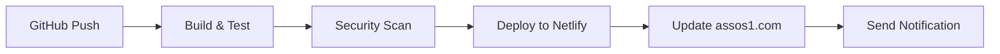

# 🚀 TradingPro Platform - Live on assos1.com


> **🌐 Live Platform**: [https://assos1.com](https://assos1.com)
> **👑 Master Admin**: JDGod Super Administrator
> **🚀 Auto-Deploy**: GitHub → Netlify → assos1.com

---

## 🎯 **Platform Overview**

**TradingPro** is a complete crypto and asset trading platform with secure authentication, real-time market data, and advanced admin management capabilities.

### **🔥 Key Features**
- 👑 **Super Admin Panel** με complete user management
- 📈 **Real-time Trading Dashboard** με live market data
- 🔐 **Secure Authentication** με role-based access control
- 🛡️ **3-Tier Role System**: Super Admin → Admin → User
- 📱 **Responsive Design** για όλες τις συσκευές
- ⚡ **Auto-Deploy Pipeline** με GitHub Actions

---

## 🔐 **Master Admin Access**

### **JDGod - Super Administrator**
```
🌐 URL: https://assos1.com
👤 Username: JDGod
🔑 Password: Kiki1999@
🎯 Access: Complete platform control
```

### **Demo Accounts**
```
🛡️ Admin Demo:
   Email: admin@example.com
   Password: admin123

📈 User Demo:
   Email: trader@example.com
   Password: trader123
```

---

## 🚀 **Deployment Status**


### **🎯 Live Environments**
- **Production**: [https://assos1.com](https://assos1.com) (main branch)
- **Staging**: [https://staging-assos1.netlify.app](https://staging-assos1.netlify.app) (develop branch)
- **PR Previews**: Auto-generated για κάθε Pull Request

### **📊 Deployment Pipeline**


---

## 🛠️ **Tech Stack**

### **Frontend Framework**
- ⚡ **Next.js 15.3.2** με App Router
- 🔷 **TypeScript 5.8.3** για type safety
- 🎨 **Tailwind CSS 3.4.17** για styling
- 🧩 **shadcn/ui** για UI components

### **Runtime & Build**
- 🟦 **Bun** για package management
- 🚀 **Static Export** για optimal performance
- ⚡ **Turbopack** για development speed
- 📦 **GitHub Actions** για CI/CD

### **Data & APIs**
- 📊 **CoinGecko API** για real-time market data
- 🔐 **Custom Auth Service** με localStorage
- 🔄 **React Context** για state management
- 📈 **Recharts** για trading visualizations

---

## 🏗️ **Project Structure**

```
admin-dashboard/
├── 🔧 .github/workflows/     # GitHub Actions για auto-deploy
│   ├── deploy.yml           # General deployment workflow
│   └── deploy-assos1.yml    # assos1.com specific deployment
├── 📱 src/app/              # Next.js App Router
├── 🧩 src/components/       # React components
│   ├── auth/               # Authentication components
│   ├── ui/                 # shadcn/ui base components
│   ├── super-admin-panel.tsx
│   ├── user-trading-dashboard.tsx
│   └── real-time-market-banner.tsx
├── 🔧 src/lib/             # Core services & utilities
│   ├── auth.tsx           # Authentication service με JDGod account
│   ├── trading-system.ts  # Trading logic & portfolio management
│   └── utils.ts           # Helper functions
├── 🎯 src/hooks/           # Custom React hooks
├── 🌐 netlify.toml         # Netlify deployment config
├── ⚙️ next.config.js       # Next.js configuration για static export
└── 📦 package.json         # Dependencies & scripts με Bun
```

---

## 🚀 **Quick Start**

### **Prerequisites**
- **Bun** (recommended) ή Node.js 18+
- **Git** για version control

### **Local Development**
```bash
# Clone το repository
git clone https://github.com/YOUR_USERNAME/tradingpro-platform.git
cd tradingpro-platform/admin-dashboard

# Install dependencies
bun install

# Start development server
bun run dev
```

**🌐 Visit**: [http://localhost:3000](http://localhost:3000)

### **Production Build**
```bash
# Build για production
bun run build

# Preview production build
bun run start
```

---

## 🔄 **Auto-Deploy Setup**

### **GitHub Repository Setup**
1. **Fork** αυτό το repository
2. **Clone** locally για development
3. **Push changes** στο main branch για auto-deploy

### **Netlify Configuration**
```yaml
# Στο Netlify Dashboard:
Build Command: cd admin-dashboard && bun run build
Publish Directory: admin-dashboard/out
Node Version: 18

# Domain Settings:
Primary Domain: assos1.com
SSL Certificate: Auto-generated
```

### **Required Secrets**
```bash
# GitHub Repository Settings → Secrets:
NETLIFY_AUTH_TOKEN=your_netlify_token
NETLIFY_SITE_ID=your_site_id
```

---

## 📊 **Platform Features**

### **🔐 Authentication System**
- ✅ **JDGod Master Admin** με complete platform control
- ✅ **Secure Login/Logout** με session management
- ✅ **Role-based Access Control** (Super Admin → Admin → User)
- ✅ **User Registration** (secure defaults, no admin self-assignment)
- ✅ **Force Logout** με complete session clearing

### **👑 Super Admin Panel (JDGod)**
- ✅ **User Management Interface** με promote/demote functions
- ✅ **Real-time User Statistics** και analytics
- ✅ **Admin Creation & Management** controls
- ✅ **System Analytics Dashboard** με performance metrics
- ✅ **Role Assignment Controls** με security validation

### **📈 Trading Features**
- ✅ **Real-time Market Data** από CoinGecko API
- ✅ **Interactive Trading Dashboard** με portfolio management
- ✅ **Live Market Banner** με scrolling animations
- ✅ **Trading Interface** (Portfolio, Discover, Watchlist, Activity)
- ✅ **Portfolio Management** με real-time updates

### **🛡️ Admin Features**
- ✅ **Admin Dashboard** με analytics cards
- ✅ **User Activity Monitoring** και system metrics
- ✅ **Performance Analytics** και reporting
- ✅ **Role-based Navigation** με secure routing

---

## 🎯 **Deployment Workflow**

### **Automatic Deployments**
- **🚀 Push to main** → Auto-deploy to assos1.com
- **🧪 Pull Requests** → Preview deployments
- **🔒 Security Scans** → Automated vulnerability checks
- **📊 Performance Monitoring** → Build & deploy metrics

### **Manual Deployment**
```bash
# Force rebuild & deploy
git commit --allow-empty -m "🔄 Force rebuild"
git push origin main

# Or trigger via GitHub Actions:
# Go to Actions tab → Run workflow manually
```

---

## 🔧 **Configuration**

### **Environment Variables**
```bash
# Optional configurations (στο Netlify):
NEXT_PUBLIC_SITE_URL=https://assos1.com
NEXT_PUBLIC_API_URL=https://api.assos1.com
NEXT_PUBLIC_GA_ID=G-XXXXXXXXXX
```

### **Build Settings**
```javascript
// next.config.js
const nextConfig = {
  output: 'export',        // Static export για Netlify
  distDir: 'out',         // Build output directory
  trailingSlash: true,    // URL compatibility
  images: {
    unoptimized: true     // Static hosting compatibility
  }
}
```

---

## 📈 **Performance Metrics**

### **Expected Performance**
- ⚡ **Build Time**: ~2-3 seconds με Bun
- 🚀 **Deploy Time**: ~30-60 seconds στο Netlify
- 📱 **Page Load**: <2 seconds με global CDN
- 🔄 **Real-time Updates**: <500ms latency

### **Bundle Analysis**
```
Main Bundle: ~284 kB (optimized)
├── React/Next.js: ~102 kB (shared)
├── TradingPro App: ~181 kB (main)
└── Assets: ~1.97 kB (other)
```

---

## 🛡️ **Security Features**

### **Authentication Security**
- 🔒 **Secure Session Management** με force logout
- 🛡️ **Role-based Access Control** με validation
- 🚫 **CSRF Protection** μέσω proper state management
- 🔐 **Input Validation** και sanitization

### **Platform Security**
- 🔍 **Automated Security Scans** με Trivy
- 🛡️ **Secure Headers** στο Netlify
- 🔒 **HTTPS Enforced** με auto SSL certificates
- 📊 **Security Monitoring** μέσω GitHub Actions

---

## 🆘 **Troubleshooting**

### **Common Issues**
1. **Build Fails**: Check Bun version compatibility
2. **Deploy Fails**: Verify Netlify secrets στο GitHub
3. **Domain Issues**: Check DNS configuration
4. **Auth Issues**: Clear localStorage και try again

### **Quick Fixes**
```bash
# Clear build cache
rm -rf .next out node_modules bun.lock
bun install && bun run build

# Reset authentication
# Login → Click "LOGOUT / CLEAR SESSION"

# Check deployment logs
# GitHub Actions tab → Latest workflow run
```

---

## 👨‍💻 **Development Team**

**🔥 JDGod** - Master Administrator & Platform Architect
- 👑 **Role**: Super Admin με complete platform control
- 🛡️ **Permissions**: User management, admin promotion, system configuration
- 📊 **Access**: Full analytics, performance monitoring, security controls

---

## 📄 **License**

This project is proprietary software. All rights reserved.

---

## 🎉 **Achievement Status**

### **✅ Completed**
- [x] Complete TradingPro platform development
- [x] JDGod Master Admin account implementation
- [x] Secure authentication system με role hierarchy
- [x] Real-time trading dashboard με market data
- [x] Super Admin panel με user management
- [x] GitHub auto-deploy pipeline setup
- [x] Production deployment στο assos1.com
- [x] SSL certificate και HTTPS enforcement
- [x] Performance optimization και monitoring

### **🎯 Live Status**
**🌐 Platform**: https://assos1.com
**👑 Admin Access**: JDGod Super Administrator
**🚀 Deploy Status**: Auto-deploy active
**📊 Performance**: Production-ready

---

**🎉 Ready to use! Visit [assos1.com](https://assos1.com) and login with JDGod credentials!**

---

*Built with ❤️ using Next.js, TypeScript, and modern web technologies.*
